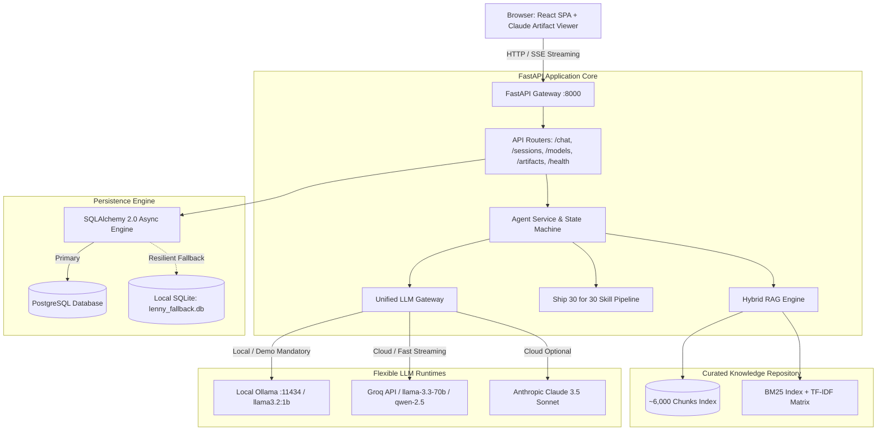
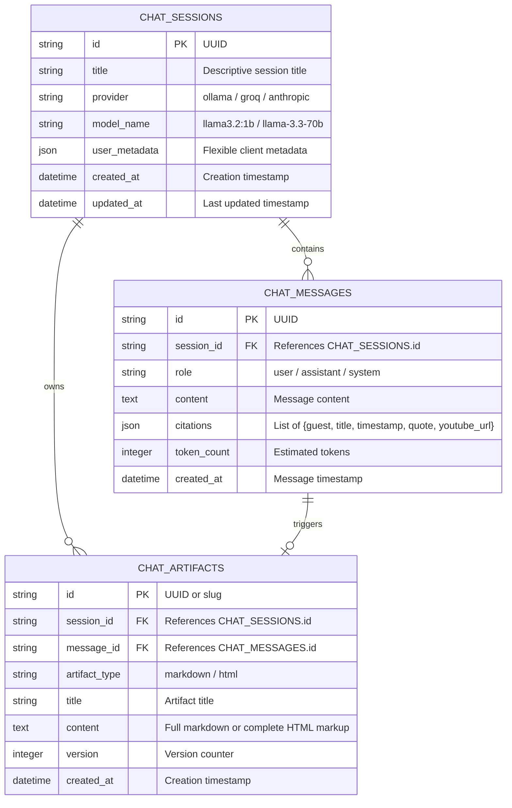
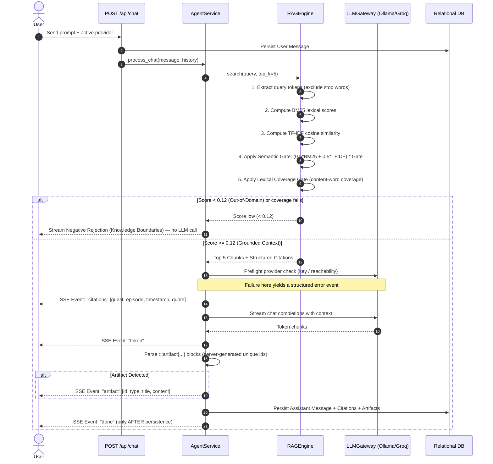
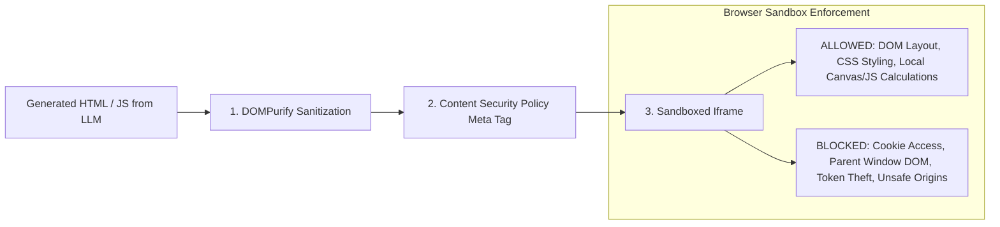

# System Architecture & Technical Specifications
## The Lenny Growth Assistant

**Architecture Style:** Decoupled Micro-services (FastAPI REST/SSE + Vite React SPA)  
**Database:** PostgreSQL (with automated resilient SQLite fallback)  
**Search Engine:** Hybrid BM25 Lexical + TF-IDF Cosine Similarity with Semantic Gating  
**Model Gateway:** Unified multi-provider abstraction (Local Ollama, Cloud Groq, Anthropic, OpenAI)  

---

## 1. System Topology & Component Diagram



### 1.1 Agent Layer & Provider Strategy (brief compliance note)

The assignment brief suggests building the agent layer with the Anthropic
Claude Agent SDK or Pi Coding Agent. This build deliberately uses a
purpose-built agent service (`services/agent.py`) with explicit skill
boundaries (grounded Q&A / Ship 30 skill / HTML-artifact skill) and routing,
plus the official **Anthropic SDK** (`anthropic`) as the Anthropic provider
adapter inside the LLM gateway. Trade-off, documented in PRD §1.3:

- The Claude Agent SDK targets hosted Claude workflows (tools, subagents,
  computer use); it cannot drive the mandatory **local Ollama `llama3.2:1b`**
  demo, the offline evaluator path, or the Groq/OpenAI/custom providers the
  gateway must route to without code changes.
- The custom agent keeps the full turn in-process: SSE streaming control,
  retrieval gates, citation emission, artifact parsing, and persist-before-
  `done` are all directly observable and hermetic-testable (34 tests, no
  network, no keys).
- Provider-level resilience the brief asks for is implemented in the gateway:
  explicit timeouts (Ollama 180 s, cloud 90 s, Anthropic SDK 90 s, health
  checks 2.5 s), preflight validation, structured error events, and honest
  health semantics.

---

## 2. Database Schema & Data Models

The persistence schema is defined in `backend/app/models/db_models.py` using SQLAlchemy 2.0 async models:

### 2.1 Entity Relationship Diagram (ERD)



### 2.2 Resilient Database Handshake
On application startup, `backend/app/core/database.py` executes:
1. Connects to `DATABASE_URL` with a 3-second connection timeout.
2. If PostgreSQL is healthy, initializes async session pools for PostgreSQL.
3. If PostgreSQL connection raises an exception (`Errno 61`, socket timeout, or missing Docker container), logs a structured operational warning and transparently switches to `sqlite+aiosqlite:///data/lenny_fallback.db`.
4. Tables are auto-created on the active database engine via `Base.metadata.create_all`.

---

## 3. Ingestion, Indexing, & RAG Grounding Pipeline



### 3.1 Scoring & rejection thresholds
- `semantic_gate = clip(tfidf_sim / 0.12, 0, 1)` prevents incidental single-keyword hits from dominating.
- **Lexical coverage gate:** content tokens are query words with IDF ≥ 5.0
  (i.e. appearing in fewer than ~1.5% of chunks — conversational filler like
  "advice" or "growth" is excluded). Two-phase ranking applies the coverage
  factor to a 200-candidate window and zeroes everything else, so ungated
  low-rank chunks can never outrank gated candidates.
- **Rejection:** multi-content-token queries are force-rejected when the single
  best chunk fails coverage (≥ 3 content tokens: < 50% covered; exactly 2:
  < 100% covered). Otherwise the agent rejects at `max_score < 0.12`.
- **Ingestion dedup:** `ingest.py` skips archive directories whose `video_id`
  was already indexed (11 duplicate directories in the archive), producing
  139 unique episodes / ~6,000 chunks from the top-150 selection.

---

## 4. API Specification & Request/Response Contracts

### 4.1 Chat Streaming Endpoint: `POST /api/chat`
- **Request Body:**
  ```json
  {
    "message": "What does Shreyas Doshi teach about pre-mortems?",
    "session_id": "bcf16ad1-d5c7-4810-84ab-5b3e56c908d5",
    "provider": "ollama",
    "model": "llama3.2:1b",
    "skill": "chat",
    "stream": true
  }
  ```
- **Streaming Response (`stream: true`, default):** `text/event-stream` (Server-Sent Events)
  - `event: session_init` -> `{"session_id": "...", "title": "..."}`
  - `event: status` -> `{"data": "Searching Lenny's Podcast knowledge base..."}`
  - `event: citations` -> `[{"guest": "Shreyas Doshi", "title": "...", "youtube_url": "https://youtube.com/watch?v=...&t=1490s", "timestamp": "00:24:50", "quote": "...", "relevance_score": 0.76}]`
  - `event: token` -> `{"data": "According to Shreyas Doshi..."}`
  - `event: artifact` -> `{"id": "...", "artifact_type": "markdown", "title": "...", "content": "..."}`
  - `event: error` -> `{"data": "Actionable, user-safe error message"}` (provider failures)
  - `event: done` -> `{"session_id": "...", "artifacts_count": 1, "persisted": true}` — emitted **after** the assistant turn is committed to the database
- **Non-streaming Response (`stream: false`):** the same turn as a single JSON object:
  ```json
  {
    "session_id": "...", "title": "...", "content": "...",
    "citations": [...], "artifacts": [...], "status_updates": [...],
    "error": null, "suggestions": [...], "rejection": false, "persisted": true
  }
  ```

### 4.2 Sessions Endpoints: `/api/sessions`
- `GET /api/sessions`: Returns ordered list of active sessions with message counts.
- `POST /api/sessions`: Creates an explicit session.
- `GET /api/sessions/{id}`: Returns complete message history, citations JSON, and created artifacts.
- `DELETE /api/sessions/{id}`: Cascading deletion of session, messages, and artifacts.

### 4.3 Models Endpoint: `/api/models`
- `GET /api/models`: Returns list of providers, available models, local vs. cloud flags, and health details.
- `POST /api/models/active`: Switches default provider at runtime without restarting the application.

### 4.4 Health Endpoint: `GET /api/health`
- Returns status `200 OK` with an **honest** status field (`healthy` only when the DB is connected, the search index is loaded, and at least one model is available; otherwise `degraded`):
  ```json
  {
    "status": "degraded",
    "version": "1.0.0",
    "database_type": "sqlite",
    "database_connected": true,
    "index_loaded": false,
    "total_indexed_chunks": 0,
    "active_provider": "ollama",
    "models": [
      {
        "provider": "ollama",
        "model_name": "llama3.2:1b",
        "available": false,
        "is_local": true,
        "details": "Ollama unreachable at http://localhost:11434: ConnectError"
      }
    ]
  }
  ```

---

## 5. Security & Untrusted Artifact Isolation Architecture

Section 4.3 explicitly mandates:
> *"Treat generated HTML as untrusted. Explain and implement a reasonable isolation or sanitization strategy for artifact rendering. The evaluator should be able to understand what the viewer permits, blocks, and why."*

### 5.1 The Threat Model
When an LLM generates HTML, CSS, or JavaScript (e.g., interactive calculators, dashboards, or prototypes), untrusted user input or malicious prompt injections could theoretically generate code that attempts to:
1. Steal session tokens or credentials from `localStorage` or `document.cookie`.
2. Access the parent application window via `window.parent` or `window.top`.
3. Make unauthorized API requests to backend endpoints on behalf of the user (Cross-Site Scripting / CSRF).
4. Phish credentials via spoofed login frames.

### 5.2 Defense-in-Depth Implementation



1. **Layer 1: Structural Sanitization via DOMPurify:**
   All markup passes through `DOMPurify.sanitize(content, { WHOLE_DOCUMENT: true })` prior to insertion into the viewer. A `uponSanitizeElement` hook removes every `<script>` element that does not load from an `https://` CDN, so inline script blocks never reach the renderer.
2. **Layer 2: Sandboxed Iframe (`sandbox="allow-scripts"`):**
   The HTML is injected into `<iframe sandbox="allow-scripts" referrerPolicy="no-referrer" srcDoc={sanitizedHtml} />`.
   - **Why `allow-scripts` is allowed:** Enables users to interact with sliders, input fields, tabs, and interactive JavaScript logic in calculators and prototypes.
   - **Why `allow-same-origin` is STRICTLY EXCLUDED:**
     Omitting `allow-same-origin` causes the browser to assign the iframe an opaque unique origin `null`. Even with scripts enabled, code executing inside the iframe **CANNOT**:
     - Read or write `document.cookie`
     - Read or write `window.localStorage` or `sessionStorage`
     - Access `window.parent.document` (cross-origin violation)
     - Submit authenticated requests with parent ambient credentials.
   - **"Open in New Tab" keeps the sandbox:** the blob URL handed to the new tab is a *wrapper page containing no LLM content* — it embeds the artifact inside a fresh `<iframe sandbox="allow-scripts">`. The artifact is never rendered in a privileged context.
3. **Layer 3: Content Security Policy (CSP):**
   A strict `<meta http-equiv="Content-Security-Policy">` is injected into the iframe's `<head>`:
   ```html
   default-src 'none';
   script-src 'unsafe-inline' 'unsafe-eval' https://cdn.tailwindcss.com https://cdn.jsdelivr.net;
   style-src 'unsafe-inline' https://cdn.tailwindcss.com https://fonts.googleapis.com;
   font-src https://fonts.gstatic.com;
   img-src data: https:;
   object-src 'none';
   base-uri 'none';
   form-action 'none';
   ```
   `default-src 'none'` prevents the artifact from making outbound fetch/XHR
   requests to arbitrary exfiltration servers, while the script-src allow-list
   permits only the Tailwind and jsDelivr CDNs. `object-src`/`base-uri`/
   `form-action` close plugin embedding, `<base>` URL tricks, and form
   submission (phishing) respectively.

---

## 6. Deployment Topology & Operational Readiness

### 6.1 Mode A: Native Zero-Dependency Run (`./run.sh`)
- Ideal for quick evaluation on any laptop with Python 3.11+ and Node 18+.
- Runs backend on port 8000 and frontend on port 5173.
- If PostgreSQL is not active on port 5432, immediately falls back to SQLite.
- Integrates trap handlers to gracefully kill background processes on `Ctrl+C`.

### 6.2 Mode B: Containerized Multi-Service (`docker-compose.yml`)
- Spins up 3 isolated services:
  1. `postgres`: PostgreSQL 16 container with `pgvector` extension (healthcheck-gated).
  2. `backend`: FastAPI image with Python 3.12 slim; builds the search index at **image build time** so the API is fully functional immediately; includes its own HEALTHCHECK.
  3. `frontend`: Node 20 container running Vite; `/api` requests are proxied to the `backend` container via `API_PROXY_TARGET` (correctly resolving cross-container hostnames).
- Uses `host.docker.internal` to route requests to the host machine's local Ollama instance.
- `.dockerignore` files exclude `node_modules`, `.git`, databases, and generated indexes from build contexts.
